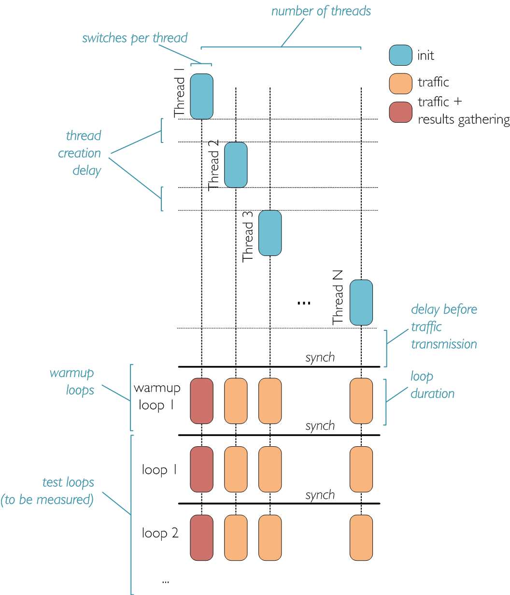

# MT-Cbench

## Motivation

MT-Cbench is an extended version of [Cbench emulator](https://github.com/andi-bigswitch/oflops/tree/master/cbench)
which uses threading (Posix threads) to generate OpenFlow traffic from multiple streams
in parallel.

The motivation behind this extension is to provide the ability for booting-up
and operating network topologies with OpenDaylight, much larger than those being
able with the original Cbench traffic generator. The problem with the original
Cbench is that, large number of switches (e.g. 200) cannot be connected to the
OpenDaylight controller large at once, without causing the controller to crash.

Even though original Cbench offers command line options for group-wise switch
addition, with configurable delays between groups, these options did not help
with OpenDaylight, because early-added switches were not able to respond to
initialization messages while the boot-up process for the remaining switches was
still ongoing. For this reason a multi-threaded implementation has been
resorted, which makes switches owned by different threads independent from each
other and therefore responsive to controller requests.

Our initial results show that we can boot-up topologies of [5000 switches](https://github.com/intracom-telecom-sdn/nstat/wiki/ODL-scalability-results),
and perhaps more.

## Features

- **Multithreaded execution**: the user can specify a configurable number of
  threads to launch with MT-Cbench, each emulating the same number of switches.
  In this way we can efficiently leverage multi-core architectures to scale the
  amount of generated traffic with the number of cores.

- **Delay between thread creation (i.e., group-wise switch addition)**: the user
  can specify the delay between thread creation. This means that switches will
  connect to the controller in batches, with a specific delay between each batch.
  In this way large topologies can be connected gradually to the controller,
  while fine-tuning how they will connect, something not being possible with
  standard Cbench. Each thread created does not pause its execution while other
  threads are in line for creation, and therefore remains responsive to
  controller   requests.

- **Delay between traffic initiation**: after all threads have been launched
  and have created their switches, they sleep for a configurable delay before
  starting sending traffic. This delay is configurable, and makes possible
  test scenarios such as [idle tests](https://github.com/intracom-telecom-sdn/nstat/wiki/SB-Idle-Test).

## Usage

The command line options supported by MT-Cbench are:

- `-Z` (`--total-threads`): total number of MT-Cbench threads
- `-S` (`--switches-per-thread`): total number of switches per thread
- `-T` (`--delay-per-thread`): delay between creation of consecutive threads.
  This flag allows gradually connecting topologies to the controller.
- `-D` (`--delay`): delay starting traffic transmission
- `-q` (`--debug-threads`): enable thread-level debugging
- `-d` (`--debug`): enable debugging
- `-c` (`--controller`): controller hostname or IP address
- `-p` (`--port`): controller port for switches to connect to
- `-M` (`--mac-addresses`): unique source MAC addresses per switch
- `-l` (`--loops`): internal iterations per test
- `-m` (`--ms-per-test`): duration of an internal iterations (in msec)
- `-t` (`--throughput`): use generator in "throughput" mode
- `-w` (`--warmup`): number of initial internal iterations that should be
  treated as "warmup" and are not considered when computing aggregate
  performance results
- `-c` (`--cooldown`): number of final internal iterations to be disregarded
- `-L` (`--learn-dst-macs`): send gratuitious ARP replies to lean destination
   macs before testing

In addition to thread related messages, the output of MT-Cbench is the same as
the original Cbench. As described in the [code design](https://github.com/intracom-telecom-sdn/nstat/wiki/Code-design#generator-handlers-conventions)
page, this is an essential requirement for the tests of NSTAT to be compatible
with MT-Cbench.

## Execution flow

The figure below demonstrates MT-Cbench execution flow. During initialization,
threads are created one-by-one, with delay between them (`-T`). After
initialization and before traffic initiation threads sleep for a specific delay
(`-D`).  At the end of each internal iteration threads synchronize into a
barrier, so that partial measurements can be aggregated and reported by a single
thread.

